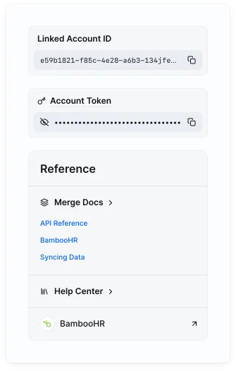
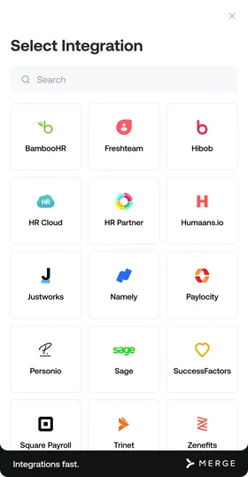

# API Integration

> Original API guide: [MERGE](https://docs.merge.dev/basics/authentication/)

# Authentication

Learn how to authenticate your requests to the Merge API.

## Overview

When making requests to the Merge API, you will need to pass proper authentication parameters so that you can identify yourself as an authorized user.

There are two primary authentication protocols we will explore below:

* [Merge API key](https://docs.merge.dev/basics/authentication/#api-key)
* [Linked Account tokens](https://docs.merge.dev/basics/authentication/#account-tokens)

The credentials you retrieve from these protocols need to be included in the headers for every request you send to the Merge API.

## Merge API key

For any request you make when communicating with the Merge API, you will need an API key to authenticate yourself as an authorized user. You should have saved your access key after creating it in Merge, but if you no longer have it, you can regenerate your Production Access Key or create a new Remote Production or Test Access Key in [API Keys](https://app.merge.dev/keys?_gl=1*1k8c3bn*_gcl_au*NzEzMjExNTk3LjE3NDc1ODg4OTc.*_ga*MTc4NzY4NjYyMi4xNzQ3NTg4ODk4*_ga_S6X9VBDBJN*czE3NDc1ODg4OTckbzEkZzAkdDE3NDc1ODg4OTgkajU5JGwwJGgwJGRVQVM0aU8yXzZHM29BejBOVlJKbjV3VGxIclZndEdwaGxB) in your Merge Dashboard.

If you’re writing your own requests, add your API key with a "Bearer " prefix as a header called `Authorization` to authorize your Merge API requests. This header must be included in every request in this format:

`Authorization: Bearer YOUR_API_KEY`

If you’re using the Merge SDK in your backend to communicate with Merge, you will add your API key as a parameter during your Merge client initialization.

```python
from __future__ import print_function

import merge
from merge.client import Merge

# Swap YOUR_API_KEY below with your production key from:
# https://app.merge.dev/keys
# Swap YOUR_ACCOUNT_TOKEN with your account key from
# the linked account page.
merge_client = Merge(api_key="<YOUR_API_KEY>", account_token="<YOUR_ACCOUNT_TOKEN>")
```

## Linked Account tokens

When sending requests to the Merge API regarding your end users’ data, you’ll only be authorized to access or manipulate that users’ data if they’ve gone through Merge Link and you’ve successfully stored their `account_token` for use with these requests.

The `account_token` also serves to signify the particular integration you wish to interact with. You can find your `account_token` at the bottom right of each Linked Account's page under the end user organization information.



Learn how to add Merge Link to your product and store your users’ `account_tokens` [here](https://docs.merge.dev/get-started/link/) and see how to use these `account_tokens` to authenticate your API requests below.



If you’re writing your own requests, add your user’s `account_token` as a header called `X-Account-Token` to authorize your Merge API requests. The `account_token` must be included in the headers for every request in this format:

`X-Account-Token: END_USER_ACCOUNT_TOKEN`

If you’re using the Merge SDK in your backend to process requests related to your end users’ data, you will add your user’s account_token as a parameter called `x_account_token` to your request.

```python
import merge
from merge.client import Merge

merge_client = Merge(api_key="<YOUR_API_KEY>", account_token="<YOUR_ACCOUNT_TOKEN>")

try:
    employee = merge_client.hris.employees.list()
except Exception as e:
    print("Exception when calling EmployeesApi->employees_list: %s" % e)
```